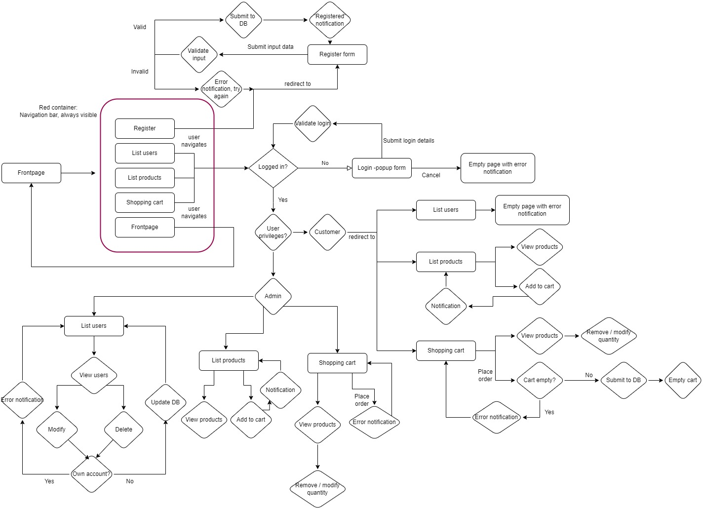

# WebProject
Simple nodeJs store website that uses mongoDB to store products and login info.

This is a 3-person group project that was pulled from the gitLab. The related course is Web Development 1 - Programming COMP.CS.500

# Group 

Member1:  Olivia Saukonoja
resposible for: JSDoc and Coverage

Member2:  Roope Korkee
responsible for: divide the work, code bug hunter, Heroku, SonarCube, own tests

Member3:  Topias Tiilikainen
responsible for: Add models order&product, eslint&Accessibility

> Marked responsibilities are from levels 1 and 2, other responsibilities from 8-10 were divided randomly but evenly. See more info on what each member had done in the commit history.

# WebDev1 coursework assignment

A webshop with vanilla HTML, CSS.


### The project structure

```
.
├── index.js                --> creates HTTP-server and opens the connection to the database
├── package.json            --> Includes npm script commands and packages needed for the program
├── routes.js               --> Handles HTTP requests
├── auth                    --> Folder for the auth.js
│   └──  auth.js            --> Finds and matches the current user credentials with the database details
├── controllers             --> Controls the logic of the object, e.g. for the user
│   ├──  ...                -->   ...
│   └── users.js            --> controller for user
├── models                  --> Database schemas for database collections
│                               
├── public                  --> Website frontend files
│   ├── js                  --> Web page logic
│   └── css                 --> CSS styles
├── utils                   --> Utility commands
│   ├── requestUtils.js     --> utility functions for request
│   └── responseUtils.js    --> utility functions for responses
└── test                    --> tests
│   ├── auth                --> test for authenticating the user
│   ├── controllers         --> Tests for API logic
└── └── own                 --> Self made tests


```


## The architecture 

Model-View-Controller (MVC) is the main structure of the project. The model represents the objects in the database such as users, orders, and products. The view is the frontend, files mainly in /public/ that are shown to the client. The controller handles the logic and is located in /controllers/. The client is communicating with the server from View where the user can send RESTful API requests to the controller that handles the commands and the data is fetched from the database from models to be shown to the user in the view.


## Pages and navigation


## Security concerns
User input:
- Gets validated and accepts only known inputs.

XSS:
- Content Security Policy(CSP) is used for preventing most of the XSS threats

Session hijacking:
- No known prevention

Session fixation:
- No known prevention

Session sidejacking:
 - The site uses HTTPS for communication.

CSRF:
- User-made changes are handled with a POST method with a decent error checking
- Authenticating is needed for the most part in the website and authenticating is done with Basic Authentication.
- passwords are encrypted with bcrypt with salting.

SQL injections:
- It is not a threat as there is no database that uses SQL. Using MongoDB as a NoSQL database.

NoSQL injections:
- Should not be an issue as user inputs are validated and the backend handles the communication with the DB.

Directory traversal:
 - User input gets validated and accepts only known inputs.

Authentication (HTTP Basic) provide no logout:
 - Every time the user goes to the page, it requires logging in again.

Cross-origin resource sharing (CORS)
- Accept only certain methods and headers


## Data models

User model
- Attributes: name, email, password, role
- Purpose: represents a logged in user, which is either admin or customer
- Connections to other models: none

Product model
- Attributes: name, price, image, description
- Purpose: represents a product which is on sale
- Connections to other models: none

Order model
- Attributes: customerId, items
- Purpose: represents a order which has been made by a customer
- Connections to other models: attribute items is orderedItem model

orderedItem model
- Attributes: product, quantity
- Purpose: represents one ordered item
- Connections to other models: none

## Finalization
This project has a firm base on to of which can be build a good feature rich application.

### Setup
- Download this git repository
- Make sure that node package manager is installed(**npm**)
- Do command `npm install` in project root directory (e.g. in _/webdev1-group19-main/_)
- Make sure to have **mongoDB** installed!
- Reset the database with command `npm run reset-db`
- You can run the website locally with `npm run nodemon`

The website can be foud at localhost:3000
